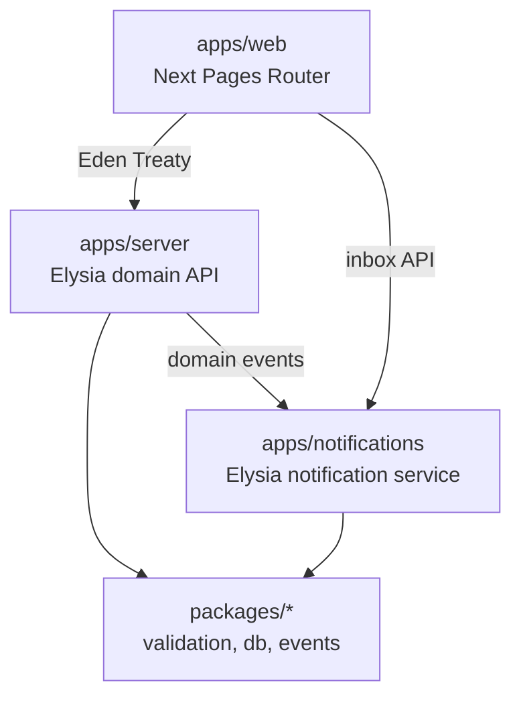
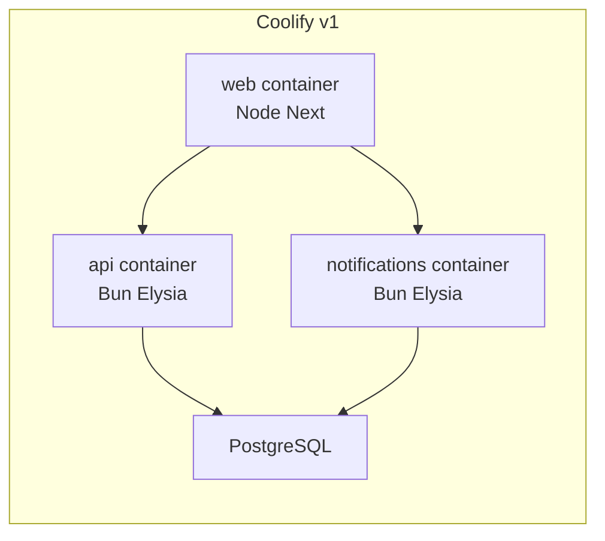

# Architecture Spine — runify.icu

## Design Paradigm

**Modular monolith** in one Turborepo: multiple deployable apps and shared packages with **hard module boundaries** and **public module APIs**. Domain logic lives in `apps/server` modules; notification delivery is a **separate app** in-repo, extractable to its own repo/deploy later without changing event contracts.



## Invariants & Rules

### AD-1 — Pages Router web, Elysia API, Eden Treaty client [ADOPTED]

- **Binds:** `apps/web`, `apps/server`, all API consumers
- **Prevents:** App Router default, tRPC, untyped fetch against internal API
- **Rule:** Routes under `apps/web/src/pages/` only. Single exported Elysia `App` type; web uses `@elysiajs/eden` Treaty. **MUST NOT** add `@trpc/*`. Shared request/response shapes in `packages/validation` (Zod only).

### AD-2 — Feature module boundaries (server + web)

- **Binds:** `apps/server/src/modules/*`, `apps/web/src/features/*`
- **Prevents:** Cross-feature deep imports, duplicated validation
- **Rule:** **MUST NOT** import another feature’s internals. Shared schemas in `packages/validation`; cross-module calls via explicit public entrypoints only.

### AD-3 — Notification module isolation

- **Binds:** `apps/notifications`, catalog/schedule modules in `apps/server`
- **Prevents:** Inbox/templates/delivery embedded in catalog CRUD; silent coupling that blocks extraction
- **Rule:** Catalog/schedule **MUST** emit **scoped domain events** (e.g. catalog row changed → affected user ids) via `packages/events` (or equivalent); **MUST NOT** send notifications inline beyond a thin publisher adapter. `apps/notifications` owns ingest, templates, per-user inbox, read state, and channel dispatch. Web inbox UI **MAY** call notification HTTP/API directly.

### AD-4 — Data ownership

- **Binds:** `packages/db`, each module
- **Prevents:** Notification tables in domain migrations without boundary; shared DB anti-pattern without rules
- **Rule:** **Primary Postgres** for runify domain (catalog, schedule, auth, RBAC). Notification persistence **MAY** share the same Postgres instance in v1 but **MUST** use a **separate schema or table namespace** owned only by `apps/notifications`. No cross-schema FKs from notification rows to domain rows except stable external ids (user id, catalog row id).

### AD-5 — Audit and multi-status columns

- **Binds:** all persistent entities in `packages/db`
- **Prevents:** Inconsistent timestamps/actors; overloaded single `status` enum
- **Rule:** Every table **MUST** include `created_at`, `updated_at`, `created_by`, `updated_by`. Soft-delete **MUST** use `deleted_at` / `deleted_by` when applicable. Use **orthogonal status columns** per concern (`publish_status`, `workflow_status`, `hub_visibility`, …) — names fixed in spec kernel.

### AD-6 — Auth and RBAC

- **Binds:** `modules/auth`, all protected routes
- **Prevents:** Ad-hoc role checks; Strava/Garmin as login
- **Rule:** **better-auth** for email/password + magic link. Roles: **runner**, **race_admin**, **platform_super_admin** (exact keys in spec). Public catalog read **MUST NOT** require session; mutating schedule/admin **MUST**.

### AD-7 — Runtime and deploy targets [ADOPTED]

- **Binds:** CI, Docker, Coolify
- **Prevents:** Bun-only Next prod; wrong process manager assumptions
- **Rule:** `apps/server` and `apps/notifications`: **Bun** in prod. `apps/web`: **Node** `next build` + `next start`. Postgres on Coolify; public DNS Cloudflare proxied; blobs R2 when needed (share-cards later).

### AD-8 — v1 product scope fence

- **Binds:** all new modules
- **Prevents:** Scope creep into integrations, profile, groups, share cards
- **Rule:** **MUST NOT** add Strava/Garmin/Coros sync, public profile URLs, groups, or share-card pipelines in v1 scaffolding. Integrations module folder **MAY** exist as empty/deferred stub only if spec explicitly schedules it later.

## Consistency Conventions

| Concern | Convention |
| --- | --- |
| Naming | kebab-case routes; snake_case DB columns; PascalCase Zod schema exports |
| IDs | UUID v7 or ULID — pick one in spec; never int serials for public ids |
| Dates | `timestamptz` in DB; **dayjs** in app code |
| Errors | Zod-validated API errors; shape defined once in `packages/validation` |
| Logging | **pino** on server/notification apps; no raw `console.log` in prod paths |
| Events | Past tense names `catalog.category_row.updated`; payload includes `affectedUserIds[]` for fan-out |

## Stack

| Name | Version |
| --- | --- |
| Better-T-Stack scaffold | 3.44.2 (checked 2026-10-03) |
| Bun | repo default |
| Next.js | Pages Router (from BTS) |
| Elysia | from BTS |
| Eden Treaty | `@elysiajs/eden` |
| Drizzle + PostgreSQL | from BTS |
| Mantine | v7 |
| better-auth | from BTS |
| Turborepo | from BTS |

Scaffold flags: `--api none`, `--frontend next`, `--backend elysia`, `--runtime bun`, `--database postgres`, `--orm drizzle`, `--auth better-auth`, `--addons turborepo` (see archived stack-proposal).

## Structural Seed

```text
apps/
  web/src/
    pages/                 # Pages Router ONLY
    features/
      catalog/
      schedule/
      suggestions/
      admin/
      inbox/               # UI only; calls apps/notifications
  server/src/
    modules/
      auth/
      catalog/
      schedule/
      suggestions/
      admin/
      rbac/
  notifications/src/       # separate Elysia app — ingest, inbox, delivery
packages/
  db/src/                  # domain schema (+ notification schema namespace)
  validation/src/          # all Zod schemas
  events/src/              # event type definitions + publisher interface
```

Post-scaffold: remove/stop using `apps/web/src/app/`; wire Eden; Mantine shell; Tailwind **only** under future `features/share-cards/**` (deferred).



## Capability → Architecture Map

| Capability / Area | Lives in | Governed by |
| --- | --- | --- |
| Public catalog browse | `modules/catalog`, `features/catalog` | AD-2, AD-6, AD-8 |
| Private schedule + hub visibility | `modules/schedule`, `features/schedule` | AD-2, AD-5, AD-8 |
| Suggest → review → publish | `modules/suggestions`, `features/suggestions` | AD-2, AD-5 |
| RBAC / super-admin | `modules/rbac`, `modules/admin` | AD-6 |
| Catalog change notifications | `modules/catalog` (emit), `apps/notifications` (deliver), `features/inbox` | AD-3, AD-4 |
| Login auth | `modules/auth` + better-auth | AD-6 |

## Deferred

- Strava/Garmin integrations and `modules/integrations` implementation (AD-8).
- Share cards + Tailwind-heavy export paths.
- Public profile, groups, social graph.
- Promoting `apps/notifications` to external repo (design for it via AD-3/AD-4).
- Email channel templates and provider (in-app first).
- Exact notification event payload fields and DB schema names (`bmad-spec`).
