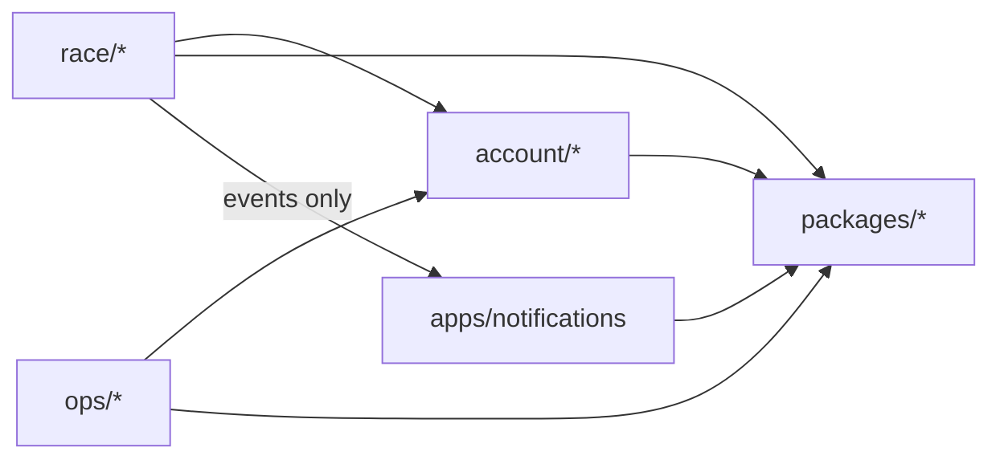

Logical **namespaces** for the modular monorepo. Physical folders match namespace roots. Import rules are **enforced** by **dependency-cruiser** (see AD-9); format and day-to-day lint use **Biome**.

## Namespace map

| Namespace | Server path | Web path | Roles / purpose |
| --- | --- | --- | --- |
| **race** | `modules/race/{catalog,schedule,suggestions}` | `features/race/{catalog,schedule,suggestions}` | Runner wedge + **race_admin** editorial (catalog CRUD, suggestion review/publish) |
| **account** | `modules/account/{auth,rbac}` | `features/account/` | Login (better-auth), role checks |
| **ops** | `modules/ops/platform/` | `features/ops/` | **platform_super_admin** — users, roles, system config; **MUST NOT** own catalog editorial |
| **notify** | `apps/notifications/` | `features/inbox/` | Inbox UI + delivery app (AD-3); not under `race/` |

Each submodule **MUST** expose a public entry (`index.ts` or `api.ts`). AD-2 applies **inside** `race/` (no deep imports between catalog / schedule / suggestions).

## Allowed dependency edges (summary)

| From | May import | Must not import |
| --- | --- | --- |
| `race/*` | `account` public API, `packages/*`, publish via `packages/events` | `ops/*` internals, `apps/notifications` internals |
| `account/*` | `packages/*` | `race/*`, `ops/*` internals |
| `ops/*` | `account` public API, `packages/*` | `race/*` internals |
| `apps/notifications` | `packages/*` | `race/*`, `ops/*` module internals |
| `apps/web/features/*` | Eden client, notification inbox API, shared UI packages | server module internals |

## Tooling (pattern 1 — locked)

| Tool | Role |
| --- | --- |
| **Biome** | Format + primary TS/JS lint (`biome check` / `biome format`) |
| **dependency-cruiser** | Namespace / layer rules (`depcruise --validate`); config at repo root after scaffold |
| **Turborepo** | Orchestrates `lint` = Biome + depcruise (+ typecheck); **does not** replace boundary rules |

**Post-scaffold:** reconcile with Better-T-Stack defaults — **MUST NOT** run two full linters; if BTS ships ESLint, remove or narrow it to avoid overlapping Biome rules. Boundary truth lives in **dependency-cruiser**.

## CI / local

- `turbo run lint` **MUST** include Biome and dependency-cruiser once apps exist.
- Lefthook **MAY** run Biome on staged TS; full depcruise on pre-push or CI only (speed).

Detail paths and rule IDs: **`bmad-spec`** enabler ticket + `.dependency-cruiser.js` (or `.cjs`) in repo root.
