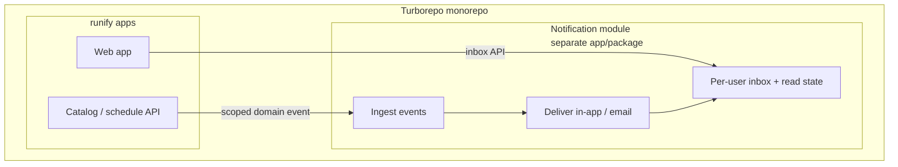
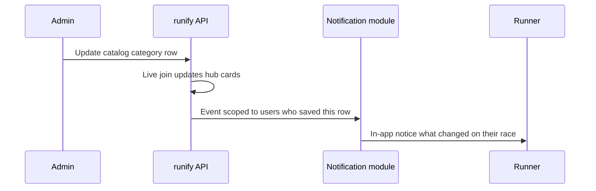
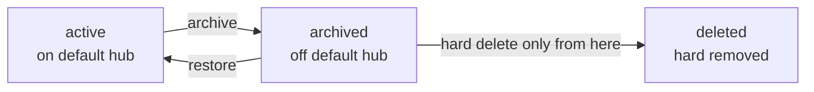
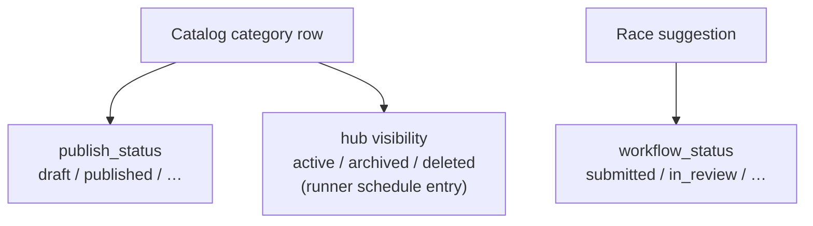
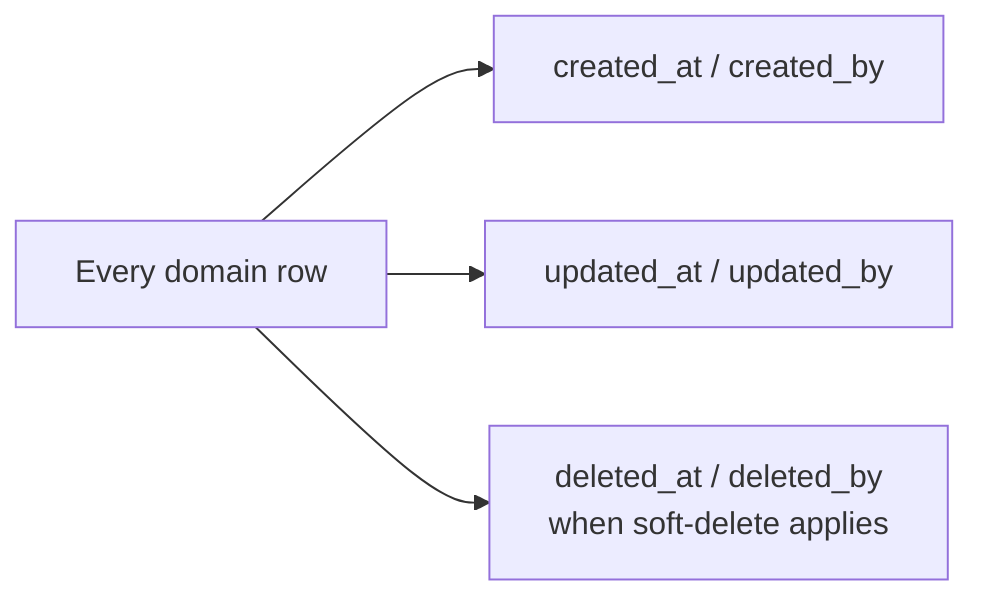

Skim [`brief-runify-icu.md`](./brief-runify-icu.md) for prose. Diagrams use **flowchart** only (IDE-safe).

## Notification boundary (monorepo module, extractable later)

Same repo today; **MAY** promote notification module to its own repo/deploy later. **MUST NOT** implement delivery/inbox inside catalog or schedule feature code.

## Catalog change to one runner

## Hub visibility (runner schedule entry)

## Multi-status pattern (entities)

One entity often carries **several orthogonal status fields** (spec names each). v1 examples:

Payment or checkout statuses are **out of v1** (no organizer checkout on runify).

## Audit fields (all persistent entities)

Exact column names and soft-delete rules **MUST** be uniform in `bmad-spec` kernel.
